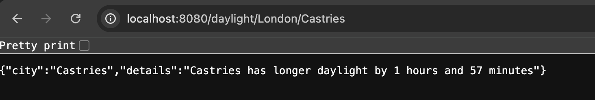

# MyWeather App Tech Test Implementation - Joie Ambrose

This documentation covers the implementation of two new features for the existing weather application:

1. Comparing daylight hours between two cities
2. Checking rain conditions across two locations

## Technologies Used

- Java 17
- Spring Boot
- Spring Web
- JUnit 5 (for unit testing)
- Mockito (for mocking dependencies)

## Implementation and Modifications

**Model Layer Modifications**
The existing CityInfo model was enhanced by adding getters and setters to support data access in the WeatherService class. This modification was for various reasons:

1. Enables access to sunrise and sunset times for daylight calculations
2. Allows reading of weather conditions for rain detection
3. Maintains proper encapsulation while working with the data

**Daylight Hours Comparison**
Endpoint: GET /daylight/{city1}/{city2}
The daylight comparison feature calculates and compares the duration of daylight between two cities.

Key implementation details:

1. Utilises Java's LocalTime for precise time calculations
2. Processes sunrise and sunset times from the existing API data
3. Returns both the city with longer daylight and the time difference

Null checks were also implemented to handle missing data.

**Rain Check**
Endpoint: GET /rain/{city1}/{city2}
This feature compares current rain conditions between two cities.

Key implementation details:

1. Uses case-insensitive string matching to detect rain conditions
2. Handles all possible rain scenarios (both, neither, or either city)
3. Returns both status and descriptive message e.g. if it is raining in both London and Paris will return: "status:both and details: "It is currently raining in both London and Amsterdam""

Null checks were also implemented to handle missing data.

## Error Handling

Error/exception handling was included in the controller, and is explained in code comments. Key error handling includes:

1. Implemented specific error handling for API-related issues
2. Added general exception handling for unexpected errors
3. Used appropriate HTTP status codes for different error types

## Testing

Implemented comprehensive unit tests using JUnit and Mockito:

1. Created test cases for scenarios for both features
2. Used mocking to simulate the repository layer
3. Included edge cases and error conditions
4. Created helper methods to reduce test code duplication

Test scenarios include:

1. First city having longer daylight
2. Second city having longer daylight
3. Various rain conditions (both cities, neither city, one city)
4. Error cases and invalid inputs

## Steps to Run

1. Clone the Repository

```bash
git clone [your-repository-url]
cd myweatherapp-tech-test
```

2. Configure API Key

- Create a free account at Visual Crossing Weather API.
- Get your API key from the account dashboard.
- Add your key to src/main/resources/application.properties

3. Build the application

```bash
mvn clean install
```

4. Run the application

```bash
mvn spring-boot:run
```

The application will start on your local host.

Example usage:

